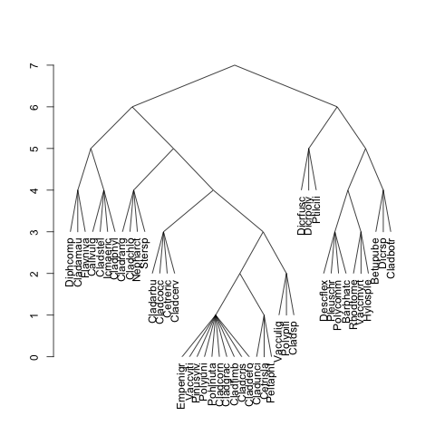

# twinspan
**R** package for Two-Way Indicator Species Analysis (Hill 1979).

Two-Way Indicator Species Analysis was developed to classify
community data tables. It was supposed to work in the same 
way as a traditional community ecologist in arranging a
community data table.

TWINSPAN is available as a self-standing computer program that
can be compiled to work on many platforms. This R package uses
the same Fortran code, but allows using TWINSPAN from **R** 
together with other **R** functions for community ecology and
statistics.

The design philosophy of TWINSPAN is completely different from
well-behaved **R** functions. TWINSPAN is a traditional console
program that runs through a process, and prints its results as
it advances. In **R**, the function should work silently, and
return the result for further analysis. The code needs a thorough
re-design to be used in **R**.

## Version History

- **0.1:** Development version unsuitable for any work.
- **0.2:** Marginally usable: performs SU (quadrat) classification and has 
  support function `cut` to find SU class membership vector for any level
  of hierarchy. No species classification, no diagnostics, no information
  on indicator species.
- **0.3:** Adds species classification. 
- **0.4:** Returns eigenvalues and indicator species for each division.
  However, most support functions are still missing, and the result object
  must be inspected manually.
- **0.5:** Basically done and usable: output contains all basic
  objects that are needed. However, most support functions are
  missing, and these elements must be accessed and handled
  manually. The next section describes the structure of the result
  object and its handling.
- **0.6:** Has now most support functions: `summary` gives the division
  history and lists the signed indicator species, `cut` returns quadrat
  or species classification at any level, `twintable` prints the 
  classified community table, `as.dendrogram` displays the divisions as
  a denrogram that can be plotted and handled with standard dendrogram 
  tools, `predict` uses indicator species to allocate quadrats to established
  classes also with `newdata`. In addition, `twinsform` transforms data so that
  its correspondence analysis is similar to the one in `twinspan`. However,
  the function is not tested with all non-default options and documentation is
  still rudimentary.
  
## What you can do with twinspan?

The basic command to run twinspan is – unsurprisingly – `twinspan`:
```r
> library(twinspan)
> library(vegan) # for data 
> data(varespec)
> tw <- twinspan(varespec)
```
This will run the analysis with default options, including the default cut levels.
TWINSPAN uses basically binary data, and quantitative data are broken into 
pseudospecies by species abundances using argument `cutlevels`. The default levels
are `c(0, 2, 5, 10, 20)`. Any species present in the data will be marked as `species1`
where the last digit shows the level of pseudospecies level. If that species is present
at abundance 7, TWINSPAN will also generate `species2` and  `species3`, because these
limits are exceeded. To see how data are transformed, you use command `twinsform`
that transforms the data similarly as `twinspan`:
```r
> twindat <- twinsform(varespec)
> colnames(twindat)
  [1] "Callvulg1" "Empenigr1" "Rhodtome1" "Vaccmyrt1" "Vaccviti1" "Pinusylv1"
  [7] "Descflex1" "Betupube1" "Vacculig1" "Diphcomp1" "Dicrsp1"   "Dicrfusc1"
 [13] "Dicrpoly1" "Hylosple1" "Pleuschr1" "Polypili1" "Polyjuni1" "Polycomm1"
 [19] "Pohlnuta1" "Ptilcili1" "Barbhatc1" "Cladarbu1" "Cladrang1" "Cladstel1"
 [25] "Cladunci1" "Cladcocc1" "Cladcorn1" "Cladgrac1" "Cladfimb1" "Cladcris1"
 [31] "Cladchlo1" "Cladbotr1" "Cladamau1" "Cladsp1"   "Cetreric1" "Cetrisla1"
 [37] "Flavniva1" "Nepharct1" "Stersp1"   "Peltapht1" "Icmaeric1" "Cladcerv1"
 [43] "Claddefo1" "Cladphyl1" "Callvulg2" "Empenigr2" "Rhodtome2" "Vaccmyrt2"
 [49] "Vaccviti2" "Descflex2" "Vacculig2" "Diphcomp2" "Dicrsp2"   "Dicrfusc2"
 [55] "Dicrpoly2" "Hylosple2" "Pleuschr2" "Polyjuni2" "Ptilcili2" "Barbhatc2"
 [61] "Cladarbu2" "Cladrang2" "Cladstel2" "Cladunci2" "Flavniva2" "Nepharct2"
 [67] "Stersp2"   "Callvulg3" "Empenigr3" "Vaccmyrt3" "Vaccviti3" "Vacculig3"
 [73] "Dicrsp3"   "Dicrfusc3" "Hylosple3" "Pleuschr3" "Polyjuni3" "Ptilcili3"
 [79] "Cladarbu3" "Cladrang3" "Cladstel3" "Cladunci3" "Flavniva3" "Stersp3"  
 [85] "Callvulg4" "Empenigr4" "Vaccmyrt4" "Vaccviti4" "Dicrsp4"   "Dicrfusc4"
 [91] "Pleuschr4" "Ptilcili4" "Cladarbu4" "Cladrang4" "Cladstel4" "Cladunci4"
 [97] "Flavniva4" "Stersp4"   "Callvulg5" "Vaccviti5" "Dicrsp5"   "Dicrfusc5"
[103] "Pleuschr5" "Cladarbu5" "Cladrang5" "Cladstel5" "Cladunci5"
```
The original data of 44 species are extended to a matrix of 107 pseudospecies.
People often use the default cut levels which are rather good for data originally
expressed in cover percentages. If you have cover class data and you want to
preserve the original accuracy, you can give your data values. For instance,
for the `dune` data in **vegan** you may use `twinspan(dune, cutlevels=1:9)`.

Use `summary` to see the classification:
```r
> summary(tw)
1) eig=0.179:  -Cladrang5 +Pleuschr4 < 1
  2) eig=0.147:  +Callvulg2 +Pleuschr3 < 2
    4) eig=0.163:  -Cladarbu3 < 0
      8) eig=0.182:  -Cetrisla1 < 0
        16) N=1: 4 
        17) eig=0.169:  +Callvulg1 < 1
          34) N=2: 7 5 
          35) N=3: 18 6 3 
      9) N=4: 2 9 12 10 
    5) N=3: 13 14 11 
  3) eig=0.203:  -Cetreric1 -Cladarbu2 +Cladstel2 < 0
    6) eig=0.161:  +Dicrsp2 < 1
      12) eig=0.206:  +Callvulg1 < 1
        24) N=1: 23 
        25) N=4: 15 22 16 20 
      13) N=2: 24 25 
    7) N=4: 27 19 28 21 
```
`twinspan` is divisive: it splits data into two parts at each step, and these steps are
described here. The splits are based on the first correspondence analysis axis of the
current subset which is still further polished to make the dichotomy clearer. The first
split is made at eigenvalue 0.179, and the pseudospecies best indicating this division
are `Cladrang5` and `Pleuschr4`. `Cladrang5` is an indicator of "negative" (or left or
first) group and `Pleuschr4` an indicator of "positive" (or right or second) group. 
These indicator species are summed up for every quadrat (or sampling unit: quadrat is
the term used in TWINSPAN). The last number after `<` gives the threshold score for
positive group: if the indicator score is less than 1, the quadrat is in the negative
group (2), and if it is 1 (or higher), the quadrat is in the positive group (3).
These groups are again divided with new correspondence analysis, and from group 2 you go 
either to 4 (negative) or 5 (positive). With default settings, groups smaller than 5
items or deeper than 7 levels of divisions are not divided. First such final groups are 34
and 35. For these final groups, `summary` gives the size (`N`) and lists
the names of the members (in this case the names are numeric).

You can extract the classification of each quadrat with `cut`:
```r
> cut(tw)
 [1] 35 25 13  7 24  7 25 25  7  5  5 25 13 34 34 35 35 16  9  9  9  9  5  7
> cut(tw, level=2) # use classification at second level
 [1] 4 6 6 7 6 7 6 6 7 5 5 6 6 4 4 4 4 4 4 4 4 4 5 7
```
You can also predict the membership of quadrats based on the indicator pseudospecies
and threshold score. This can also be done with argument `newdata` using data set that
contains same species, but is not used in developing the classification.
```r
> predict(tw, level=2)
 [1] 4 6 6 7 6 7 6 6 7 5 5 6 6 4 4 4 4 4 4 4 4 4 5 4
```
Please note that the last quadrat was classified to second-level class 7, but it is
predicted to be in class 4. This can happen because TWINSPAN classification is based
on the polished ordination, and the indicator pseudospecies only *indicate* this
division. The analysis tries to make the concordance as good as possible, but it
does not always succeed. Traditionally these quadrats are called misclassifications.
In this case, the last quadrat was misclassified on the first step: the ordination 
put it into group 3, but indicator pseudospecies to group 2.

TWINSPAN stands for *two-way* indicator species analysis, and in addition to quadrat
classification it also classifies the species (not the pseudospecies):
```r
> summary(tw, "species")
1) eig=0.543
  2) eig=0.41
    4) eig=0.272
      8) N=3: Diphcomp Cladamau Flavniva 
      9) N=4: Callvulg Cladstel Icmaeric Cladphyl 
    5) eig=0.122
      10) N=4: Cladrang Cladchlo Nepharct Stersp 
      11) eig=0.068
        22) N=4: Cladarbu Cladcocc Cetreric Cladcerv 
        23) eig=0.049
          46) eig=0.048
            92) N=10: Empenigr Vaccviti Pinusylv Polyjuni Pohlnuta Cladcorn Cladgrac Cladfimb Cladcris Claddefo 
            93) N=3: Cladunci Cetrisla Peltapht 
          47) N=3: Vacculig Polypili Cladsp 
  3) eig=0.405
    6) N=3: Dicrfusc Dicrpoly Ptilcili 
    7) eig=0.231
      14) eig=0.254
        28) N=4: Descflex Pleuschr Polycomm Barbhatc 
        29) N=3: Rhodtome Vaccmyrt Hylosple 
      15) N=3: Betupube Dicrsp Cladbotr 
```
Species classification is based on correspondence analysis where species are weighted by their
indicator potential for the quadrat classification. You can extract the classification vector
with `cut(tw, "species")`. 

The data can be tabulated with:
```r
> twintable(tw)
                 000000000000011111111111
                 000000000011100000001111
                 0000001111   0000011    
                 011111       01111      
                  00111                  
                                         
                    1    1111121212222122
                 475863292034135260457981
 000    Diphcomp -1-2-1-1--1--------1----
 000    Cladamau --11-1------------------
 000    Flavniva 411111-1-1---1-------1--
 001    Callvulg 2--1111-11522-12211-----
 001    Cladstel 5112455555415111111-25-4
 001    Icmaeric -11--------1----1-------
 001    Cladphyl -------1-1-11-----------
 010    Cladrang 555555524351533244323212
 010    Cladchlo -1--1111-11--1-1--1--1-1
 010    Nepharct -1-1-1-----------1-2----
 010      Stersp 114111---111111-1-11-11-
 0110   Cladarbu 454553112154334333231311
 0110   Cladcocc 111111-1-111111111-1-11-
 0110   Cetreric 111111-1-111--111111----
 0110   Cladcerv 1-----1------------1----
 011100 Empenigr 131432324413141333134314
 011100 Vaccviti 132442354433454424444435
 011100 Pinusylv 1-111-11111111111111-111
 011100 Polyjuni 11111-11-111121-1113-111
 011100 Pohlnuta 11-1-1-111111111111-1111
 011100 Cladcorn 111111111111111111111111
 011100 Cladgrac 111111111-11111111111111
 011100 Cladfimb 111111111111-11111-11111
 011100 Cladcris 111111111111111111111111
 011100 Claddefo 111111111111-11111111111
 011101 Cladunci 111121111115212212311111
 011101 Cetrisla 1------111111-1-1-11--11
 011101 Peltapht ---1------1-11-----11---
 01111  Vacculig 13-1-1---------2-1-11-1-
 01111  Polypili --111-------111--1---1--
 01111    Cladsp 1--11--1--1----111-11---
 10     Dicrfusc 111111111124124551-42111
 10     Dicrpoly -11----1-1--111-111--112
 10     Ptilcili ---11111--1-11111-111114
 1100   Descflex 11-------------1---12111
 1100   Pleuschr 111211123133445544555552
 1100   Polycomm -----------1-------111-1
 1100   Barbhatc ----------1--1------11-2
 1101   Rhodtome ----------1----1----2-12
 1101   Vaccmyrt -------1--11--132---3244
 1101   Hylosple -----------------1-13-3-
 111    Betupube ---------------1---1---1
 111      Dicrsp --------1-1---111154--11
 111    Cladbotr ----------1--1---11-1111
  sites species 
     24      44 
```
The strings of `0` and `1` in front of the species name and above quadrat name (or number)
give the steps of division. The numeric values in the table are the pseudospecies values
of the analysis.

The `twinspan` classification can be extracted as a standard **R** `dendrogram`. The final
units contain many branches (species, quadrats), and it is best to use fan-like trees:
```r
> plot(as.dendrogram(tw, "species"), type = "triangle")
```


### References

Hill, M.O. (1979) _TWINSPAN: A FORTRAN program for arranging multivariate
data in an ordered two-way table by classification of the individuals and
attributes_. Ecology and Systematics, Cornell University, Ithaca, NY.
