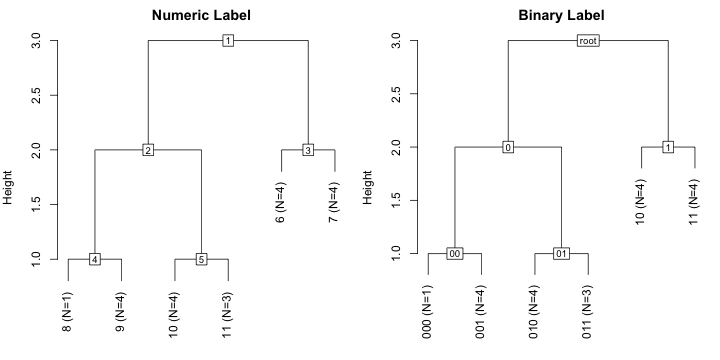
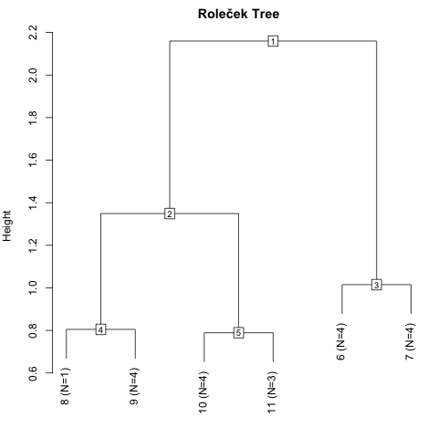

# twinspan
**R** package for Two-Way Indicator Species Analysis (Hill 1979).

Two-Way Indicator Species Analysis was developed to classify
community data tables. It was supposed to work in the same 
way as a traditional community ecologist in arranging a
community data table.

TWINSPAN is available as a self-standing computer program that
can be compiled to work on many platforms. This R package uses
the same Fortran code, but allows using TWINSPAN from **R** 
together with other **R** functions for community ecology and
statistics. The function runs silently – unlike the original
TWINSPAN – and most information can be gained analysing the
result with support functions provided in this package.
Moreover, the package allows using
Roleček _et al_ (2009) modification which bases grouping on
withing-group heterogeneity instead of cluster level.

## Installation

You can install the current development version from GitHub using
**devtools** package:
```r
devtools::install_github("jarioksa/twinspan")
```
You need development tools to install a source package. In particular,
you need **C** and **Fortran** compilers.

If you cannot install a source package, you can install **twinspan** from R-Universe:

```r
install.packages('twinspan', repos = c('https://jarioksa.r-universe.dev', 'https://cloud.r-project.org'))
```

  
## What you can do with twinspan?

The basic command to run twinspan is – unsurprisingly – `twinspan`:
```r
> library(twinspan)
> library(natto) # for data 
> data(spurn)
> tw <- twinspan(spurn, cutlevels = 0:6)
```
The example uses Spurn Point dune scrub data (Shimwell 1971).
TWINSPAN uses basically binary data, and quantitative data are broken into 
pseudospecies by species abundances using argument `cutlevels`. The default cut levels
`c(0, 2, 5, 10, 20)` are suitable for percentage values, but the `spurn` data are cover classes.
To keep the original class values, we list all cover classes as cut levels.
The pseudospecies data can be generated with `twinsform` transformation:

```r
> colnames(twinsform(spurn, cutlevels=0:6))
  [1] "Elaerham1"  "Jacovulg1"  "Soladulc1"  "Rubufrut1"  "UrtidioiA1"
  [6] "Rumecris1"  "ClayperfB1" "StelmediB1" "FestrubrC1" "ElymrepeC1"
... cut ...
[111] "ElymrepeC4" "AmmoarenC4" "Epilangu4"  "Elaerham5"  "UrtidioiA5"
[116] "ClayperfB5" "StelmediB5" "FestrubrC5" "ElymrepeC5" "AmmoarenC5"
[121] "Elaerham6"  "ClayperfB6" "AmmoarenC6" "Elaerham7" 
```
The original data of 40 species are extended to a matrix of 124 pseudospecies.
The names of pseudospecies are formed appending an integer for the cut level
after the species name. Level `1` means that the taxon occurs in the data,
and `7` that it occurs at least the seventh cut level.

The `twinspan` result can be inspected with support functions of the package.
The hierarchy of groups can be displayed as a cluster tree with
```r
> plot(tw, main = "Numeric Label")
> plot(tw, binname = TRUE, main = "Binary Label")
```


`twinspan` splits data into two groups and the height of the group shows the
level of hierarchy. The numeric labels are marked within squares, or used
as group names for terminal groups that are no longer divided. The number of
items (`N`) is also given for each terminal group. When group $k$ is split
into two, its children will be numbered $2k$ and $2k+1$ so that children
of group  2 are 4 and 5. Alternatively (with argument
`binname = TRUE`), binary text labels are used instead of numbers. The first groups
are `0` and `1`, and when these are split `0` or `1` is appended so that the children
of `0` are `00` and `01`.

The summary of division process can be inspected with `summary` (with argument
`binname = TRUE` binary labels are used instead of numeric):
```r
> summary(tw)
1) eig=0.56:  +ElymrepeC1 < 1
  2) eig=0.399:  -UrtidioiA1 < 0
    4) eig=0.355:  -Soncarve1 < 0
      8) N=1: A19 
      9) N=4: A1 A2 A3 A20 
    5) eig=0.263:  +Inulcony1 < 1
      10) eig=0.229:  -Rumecris1 < 0
        20) N=1: B16 
        21) N=4: B4 B5 B10 B12 
      11) N=2: B17 B18 
  3) eig=0.23:  +AmmoarenC5 +Jacovulg1 -Galiveru1 < 1
    6) N=3: C6 C8 X14 
    7) eig=0.226:  -Calysold1 < 0
      14) N=3: C7 C9 C15 
      15) N=2: C11 C13 
```
`twinspan` is divisive: it splits data into two parts at each step, and these steps are
described here. The splits are based on the first correspondence analysis axis of the
current subset which is still further polished to make the dichotomy clearer.
`twinspan` finds the pseudospecies that best indicate the division based on CA axis,
and `summary` shows these indicator. There are pseudospecies names with `+` or `-` signs.
These are used to calculate indicator scores for each quadrat, adding or subtracting
one for each pseudospecies in the quadrat. If the quadrat score is less than the critical
score, we proceed from group $k$ to $2k$, and if the condition is false (quadrat score is
equal or greater than the critical score), we proceed to its opposite $2k+1$. 
The first split is made at eigenvalue 0.56, and the pseudospecies best indicating this division
is `ElymrepeC1` (_Elymus repens_ at class value 1). The quadrat score will be 1 for quadrats
with _Elymys repens_ and 0 without, and with condition $< 1$ we continue from 2 with quadrats
without the species, and from 3 with quadrats with the indicator species.
These groups are again divided with new correspondence analysis, and from group 2 you go 
either to 4 (condition true) or 5 (condition false). With default settings, groups smaller than 5
items or deeper than 7 levels of divisions are not divided. For these final groups,
`summary` gives the size (`N`) and lists the names of the member quadrats. Capital letters
`A`, `B`, `C` of the quadrat name give the original classification of Shimwell (1971).

The basic `twinspan` hierarchy is based on the level of division and it does not
consider within-group heterogeneity. However, the package can evaluate heterogeneities
and use these for trees and further analyses enabling the modification of Roleček _et al_
(2009):
```r
plot(tw, height = "chi", main = "Roleček Tree")
```


The measure of heterogeneity is the sum of all eigenvalues of group as it is
analysed in `twinspan`. This is equal to scaled Chi-square, hence the name
`"chi"` in the argument.

Group 2 of the first-level division is much more heterogeneous than group 3, and for
comparable homogeneity of groups it would be best to combine level-1 group 3 with
level-2 groups 4 and 5. 

The basic `plot` and its underlying function `as.hclust` will use groups as terminal
nodes. With `as.dendrogram` it is also possible to display quadrats (like they are
called in `twinspan`):
```r
plot(as.dendrogram(tw, height="chi"), type = "triangle")
```


The dendrogram used the Roleček modification. The first letter of the quadrat name
gives the original class (Shimwell 1971), and this is fully recovered with three
classes with Roleček modification.

You can extract the classification of each quadrat with `cut` either for terminal
groups or for a certain level:
```r
> cut(tw)
 [1]  9  9  9 21 21  6 14  6 14 21 15 21 15  6 14 20 11 11  8  9
> cut(tw, level=2)
 [1] 4 4 4 5 5 6 7 6 7 5 7 5 7 6 7 5 5 5 4 4
```
The Roleček groups respecting heterogeneity can be extracted with `cuth` ("cut height")
where you must specify the number of groups:
```r
> cuth(tw, ngroups=3)
 [1] 4 4 4 5 5 3 3 3 3 5 3 5 3 3 3 5 5 5 4 4
```

You can also predict the membership of quadrats based on the indicator pseudospecies
and threshold score. This can also be done with argument `newdata` using data set that
contains same species, but is not used in developing the classification.
```r
> predict(tw, level=2)
 [1] 4 4 4 5 5 6 7 6 7 5 7 5 7 6 7 5 5 5 4 4
```
Care is needed with `newdata`:  TWINSPAN will predict a class also when the
`newdata` is completely unrelated to the original data. If there are no indicator
species, the predicted class will be the one with indicator scores always 0, or group 21
in this example.

TWINSPAN classification is based
on the polished ordination, and the indicator pseudospecies only *indicate* this
division, and `predict` based on pseudospecies can give different classificatin than
the actual TWINSPAN that split the data by polished axis of correspondence analysis.
Function `misclassified` will list the quadrats where the pseudospecies-based and
actual TWINSPAN classification differ. In this simple data set there are no such conflicts.

The data can be tabulated with:
```r
> twintable(tw)
                                      
                  00000000000011111111
                  00000111111100011111
                  011110000011   00011
                       01111          
                                      
                  A   AB  BBBB  X  CCC
                  1AAA21BB1111CC1CC111
                  91230645027868479513
 00000  ClayperfB -----6566443--------
 00000  StelmediB -----2322543--------
 00000  GeasfornB ------22-222--------
 00001  CerafontB -----2--2233--------
 00001  CirsvulgB -----2----2---------
 00001   Heraspho ----------2---------
 00001  CardhirsB ----------22--------
 0001    Inulcony ----2-----23--------
 0001    Bracruta --23--2-2222--------
 001000  Hyporadi 2-------------------
 001000  Arrhelat 3-------------------
 001001 UrtidioiA 25334---------------
 001001  Soncaspe ----2---------------
 001001 EurhpraeA 33233---------------
 001001  Lophhete ----2---------------
 00101   Sambnigr ----22--------------
 0011    Soladulc 2442332232-22-22--2-
 0011    Rubufrut 223-4223222---2-----
 0011    Epilangu 4---22--23----2-----
 0011    Hypncupr -222---22-----2-----
 01      Elaerham 77777777777756644555
 01      Jacovulg 33232222---2--222322
 01      Rumecris 322222-----2222-2-22
 10      Soncarve 2-------2---222-223-
 10      Calysold --------22-2-33222--
 10      Agrostol ----2-----2--22-22--
 10      Verocham 2-------2-----2-2---
 11000  FestrubrC -------2----33322345
 11000  BracalbiC ------------2-2-3-2-
 11001  ElymrepeC ------------22445222
 11001  AmmoarenC ------------44262653
 11001   PoapratC -------------22-2232
 1101   RanubulbC --------------2-2-22
 1101   PlanlancC --------------2-2323
 1101    Cladranf -------------------2
 111     Ononspin ------------3-------
 111     Galiveru ------------2-2-----
 111     Bryuincl ------------2-2-----
 111     Syntrura -------------22-----
 111     Bovinigr --------------2-----
20 sites, 40 species
```
The binary labels before species and above quadrats specify the
grouping. Species names ending in capital letter `A`, `B`or `C`
where regarded as diagnostic for these quadrat groups
(Shimwell 1971). The table can be large, but you can limit the
number of species or only list "leading species" for each group
(most abundant and frequent in the species group), or species
used as indicators (see `summary`) or both of these, or you
can subset quadrats.

A compact visual summary of classification can be displayed with
```r
> image(tw, height="chi", leadingspecies=TRUE, reorder=TRUE)
```


TWINSPAN stands for *TWo-way* INdicator SPecies ANalysis, and most of
the functions described above can be used to display species. For instance,
`summary(tw, "species")` will show the steps of grouping species.

### References

Hill, M.O. (1979) _TWINSPAN: A FORTRAN program for arranging multivariate
data in an ordered two-way table by classification of the individuals and
attributes_. Ecology and Systematics, Cornell University, Ithaca, NY.

Roleček, J, Tichý, L., Zelený, D. & Chytrý, M. (2009). Modified TWINSPAN
classification in which the hierarchy respects cluster heterogeneity.
_J Veg Sci_ 20: 596-602.

Shimwell, D. W. (1971) _Description and Classification of
Vegetation_. Sidgwick & Jackson.
